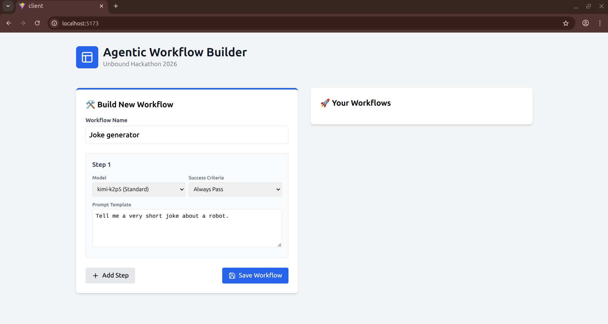
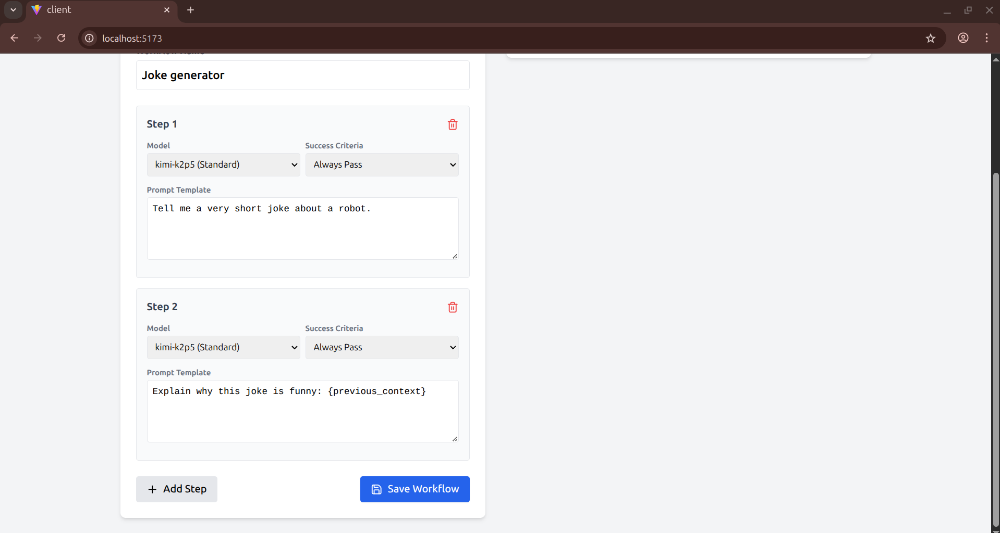
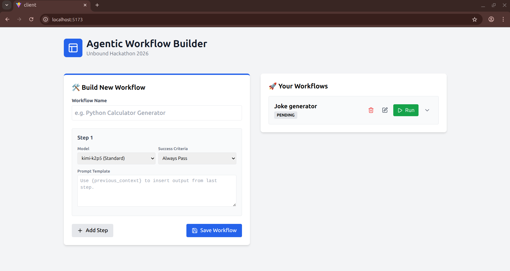
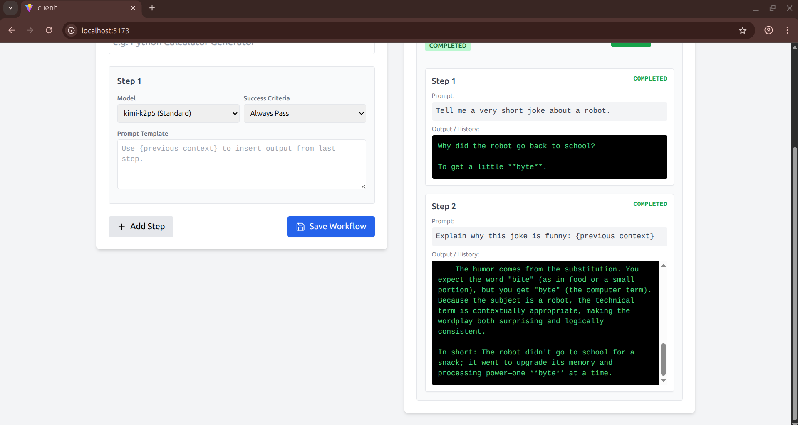

#  Agentic Workflow Builder

**Unbound Hackathon 2026**

A visual tool for building and orchestrating multi-step AI workflows. Chain multiple Large Language Models (LLMs) where the output of one "agent" becomes the input/context for the next. Use cases include code generation, content creation, analysis, and automation.

##  Features

- **Context chaining** — Inject the output of previous steps into next-step prompts with the `{previous_context}` variable.
- **Real-time progress** — Live execution status, logs, and AI responses via WebSockets (Socket.IO).
- **Visual builder** — React UI to create, edit, and delete workflows.
- **Auto-retry logic** — Retries failed API calls (configurable, default 3 attempts) with exponential backoff.
- **Persistence** — Workflows and execution history stored in SQLite.

##  Demo & Screenshots

- **Workflow Builder**
  - **
  - **
  - **
  - **
  - **

## Tech stack

- Frontend: React, Vite, Tailwind CSS
- Backend: Python, FastAPI, SQLModel (SQLite)
- Real-time: Socket.IO
- AI integration: Unbound API (e.g. kimi-k2p5)

---

##  Setup & installation

### Prerequisites

- Node.js (v18+)
- Python (v3.10+)

### Backend (server)

1. Open a terminal and change into the server directory:

```bash
cd server
```

2. Create and activate a virtual environment:

```bash
# Create venv
python -m venv venv

# macOS / Linux
source venv/bin/activate

# Windows (PowerShell)
.\venv\Scripts\Activate.ps1
```

3. Install Python dependencies and create a .env file with your Unbound credentials:

```bash
pip install -r requirements.txt

# Create .env and add:
# UNBOUND_API_KEY=your_api_key
# UNBOUND_API_URL=https://api.getunbound.ai/v1/chat/completions
```

4. Run the backend:

```bash
uvicorn main:app --reload
```

### Frontend (client)

1. In a new terminal, change into the client directory:

```bash
cd client
```

2. Install and start the dev server:

```bash
npm install
npm run dev
```

3. Open the app in your browser at http://localhost:5173

---

##  API overview

The backend exposes a REST API (FastAPI). Key endpoints:

```http
GET    /workflows/           # Retrieve all workflows
POST   /workflows/           # Create a new workflow
PUT    /workflows/{id}       # Update workflow
DELETE /workflows/{id}       # Delete workflow
POST   /workflows/{id}/run   # Execute a workflow
```

## Data models

Example step object:

```json
{
  "order": 1,
  "model": "kimi-k2p5",
  "prompt_template": "Write a python script that...",
  "completion_criteria": "always_pass"
}
```

##  Implemented bonus features

- Retry budget: steps are retried (default 3 attempts) with exponential backoff on transient failures.
- Live progress tracking via Socket.IO instead of polling.
- Error visibility: UI surfaces backend error traces (e.g., timeouts, rate limits) to aid debugging.

## Video walkthrough


[Demo video link]

---